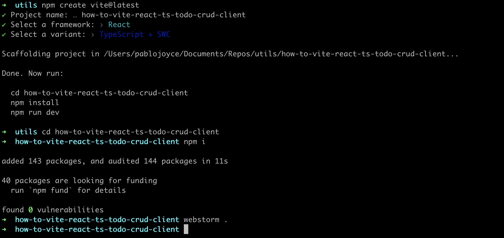
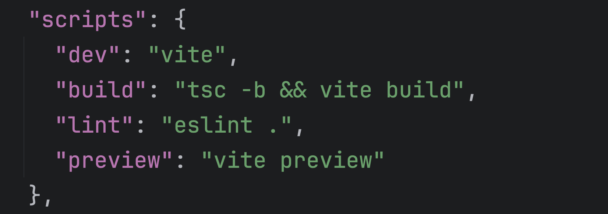

# Setting up the repository

## Create the React app

Instructions for setting up a Vite React project can be found on Vite's [Getting Started page](https://vite.dev/guide/#scaffolding-your-first-vite-project).

In terminal, navigate to the directory where you want the project to be created and enter:
```bash
npm create vite@latest
```
and follow the prompts.

|  |
|-----------------------------------------------------------------------------------------------|

In the screenshot above, you can see that I did `npm install` but did not start the app at this point. 

The command, `webstorm .`, opens the project in Webstorm IDE and you should open the project in the IDE ir text editor of your choice. That would be `code .` for VSCode and if that does not work for your VSCode then look [here](https://www.geeksforgeeks.org/how-to-open-vs-code-using-terminal/) to set that up, or open it in your usual way.

## Prettier

If you choose to use `prettier`, then this is a good time to set that up:
```bash
npm install --save-dev --save-exact prettier
```

Create a prettier config file, `.prettierrc`, and a `.prettierignore` file in the root of the project:
```bash
touch .prettierrc .prettierignore
```

I choose the following as my base configuration:
```json
{
 "semi": false,
 "singleQuote": true,
 "tabWidth": 2
}
```

This enforces single quotes and does not use semicolons. Obviously use your own preferences here.

In the `.prettierignore` file, add:
```bash
node_modules
```

To help `eslint` and `prettier` play nicely, install these plugins:
```bash
npm i -D eslint-plugin-prettier eslint-config-prettier
```

And add them to your `eslint.config.js` file:
```javascript

```


In `package.json`, there are already some scripts:

|  |
|-------------------------------------------------------------------------------------------|

As a personal preference, I prefer `npm start` to start the dev project, so I will create that now while leaving the `dev` script in place.