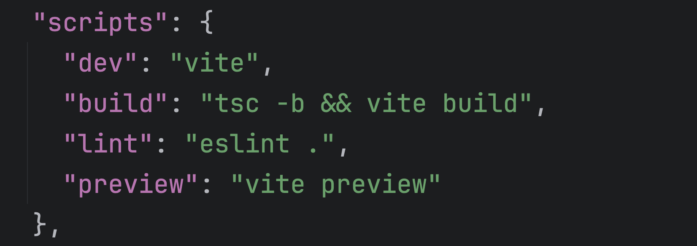

# Setting up the repository

## Create the React app

Instructions for setting up a Vite React project can be found on Vite's [Getting Started page](https://vite.dev/guide/#scaffolding-your-first-vite-project).

In terminal, navigate to the directory where you want the project to be created and enter:

```bash
npm create vite@latest
```

and follow the prompts.

|  |
| --------------------------------------------------------------------------------------------- |

In the screenshot above, you can see that I did `npm install` but did not start the app at this point.

The command, `webstorm .`, opens the project in Webstorm IDE and you should open the project in the IDE ir text editor of your choice. That would be `code .` for VSCode and if that does not work for your VSCode then look [here](https://www.geeksforgeeks.org/how-to-open-vs-code-using-terminal/) to set that up, or open it in your usual way.

## Prettier

If you choose to use `prettier`, then this is a good time to set that up:

```bash
npm install --save-dev --save-exact prettier
```

Create a prettier config file, `.prettierrc`, and a `.prettierignore` file in the root of the project:

```bash
touch .prettierrc .prettierignore
```

I choose the following as my base configuration:

```json
{
  "semi": false,
  "singleQuote": true,
  "tabWidth": 2
}
```

This enforces single quotes and does not use semicolons. Obviously use your own preferences here.

In the `.prettierignore` file, add:

```bash
node_modules
```

To help `eslint` and `prettier` play nicely, install these plugins:

```bash
npm install -D @eslint/js typescript-eslint eslint-plugin-react eslint-plugin-react-hooks eslint-plugin-react-refresh eslint-plugin-prettier prettier
```

And amend your `eslint.config.js` file:

```javascript
import js from '@eslint/js'
import globals from 'globals'
import reactHooks from 'eslint-plugin-react-hooks'
import reactRefresh from 'eslint-plugin-react-refresh'
import tseslint from 'typescript-eslint'
import prettier from 'eslint-plugin-prettier'
import react from 'eslint-plugin-react'
import prettierConfig from 'eslint-config-prettier'

export default tseslint.config(
  {
    ignores: ['dist'],
  },
  {
    files: ['**/*.{ts,tsx}'],
    extends: [
      js.configs.recommended,
      ...tseslint.configs.recommended,
      prettierConfig, // This disables ESLint rules that conflict with Prettier
    ],
    languageOptions: {
      ecmaVersion: 2020,
      globals: {
        ...globals.browser,
      },
      parser: tseslint.parser,
      parserOptions: {
        ecmaFeatures: {
          jsx: true,
        },
      },
    },
    plugins: {
      'react-hooks': reactHooks,
      'react-refresh': reactRefresh,
      prettier: prettier,
      react: react,
    },
    rules: {
      ...reactHooks.configs.recommended.rules,
      'react-refresh/only-export-components': [
        'warn',
        { allowConstantExport: true },
      ],
      'prettier/prettier': [
        'error',
        {
          semi: false,
          singleQuote: true,
          tabWidth: 2,
        },
      ],
    },
    settings: {
      react: {
        version: 'detect',
      },
    },
  },
)
```

## Adding scripts for Prettier and Eslint

In `package.json`, there are already some scripts:

|  |
| ----------------------------------------------------------------------------------------- |

You may setup whatever scripts suit you but I added the following:

```yml
"preview": "vite preview",
"prettier": "prettier . --write",
"pretty": "npm run lint && npm run prettier"
```

As a personal preference, I prefer `npm start` to start the dev project, so I will also add that now while leaving the `dev` script in place.
