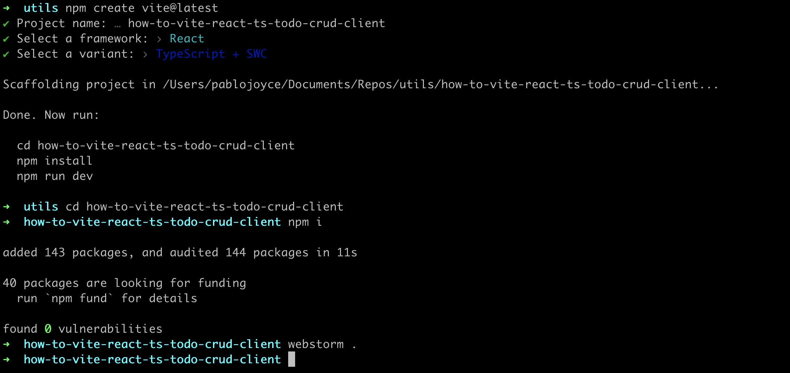

# Setting up the React app

## Create the React app

Instructions for setting up a Vite React project can be found on Vite's [Getting Started page](https://vite.dev/guide/#scaffolding-your-first-vite-project).

In terminal, navigate to the directory where you want the project to be created and enter:

```bash
npm create vite@latest
```

and follow the prompts.

|  |
| ------------------------------------------------------------------------------------------- |

In the screenshot above, you can see that I did `npm install` but did not start the app at this point.

The command, `webstorm .`, opens the project in Webstorm IDE and you should open the project in the IDE ir text editor of your choice. That would be `code .` for VSCode and if that does not work for your VSCode then look [here](https://www.geeksforgeeks.org/how-to-open-vs-code-using-terminal/) to set that up, or open it in your usual way.

## Strip out the gumpf

If you start the React app, you will see that it is built with lots of code that we have no use for.

|  |
| ---------------------------------------------------------------------------- |

### In `app.tsx`

Get rid of everything except the basic functional component, leaving just:

```javascript
import './App.css'

function App() {
  return <></>
}

export default App
```

### In `index.html`

Change the `title` text:

```html
<!doctype html>
<html lang="en">
  <head>
  <meta charset="UTF-8" />
  <link rel="icon" type="image/svg+xml" href="/triangle.svg" />
  <meta name="viewport" content="width=device-width, initial-scale=1.0" />
  <title>Todo Client</title>
</head>
<body>
  <div id="root"></div>
  <script type="module" src="/src/main.tsx"></script>
</body>
</html>
```

Above, I have also changed the image used for a `favicon` in the link element. You may also add you own here or use the default `Vite` icon if you choose.

### Delete unused images

Delete the `react.svg` in `/src/assets`.

If you are now using your own favicon, you may also delete `vite.svg` in `/public`.

### Delete CSS

Delete all the code in both `App.css` and `index.css` but leave the files as we can use them later.

[NEXT: Set up Prettier](1b_setUp_prettier.md)
