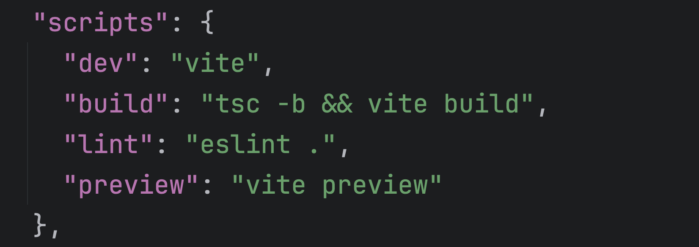

# Setting up Prettier (optional)

If you choose to use `prettier`, then this is a good time to set that up:

```bash
npm install --save-dev --save-exact prettier
```

Create a prettier config file, `.prettierrc`, and a `.prettierignore` file in the root of the project:

```bash
touch .prettierrc .prettierignore
```

I choose the following as my base configuration:

```json
{
  "semi": false,
  "singleQuote": true,
  "tabWidth": 2,
  "printWidth": 80,
  "trailingComma": "es5",
  "bracketSpacing": true,
  "singleAttributePerLine": false,
  "jsxSingleQuote": false,
  "jsxBracketSameLine": false,
  "arrowParens": "avoid",
  "endOfLine": "auto",
  "allowBlankLines": true
}

```

This enforces single quotes and does not use semicolons. Obviously use your own preferences here.

In the `.prettierignore` file, add:

```bash
node_modules
.env
```

To help `eslint` and `prettier` play nicely, install these plugins:

```bash
npm install -D @eslint/js typescript-eslint eslint-plugin-react eslint-plugin-react-hooks eslint-plugin-react-refresh eslint-plugin-prettier prettier eslint-config-prettier @stylistic/eslint-plugin
```

And amend your `eslint.config.js` file:

```javascript
import js from '@eslint/js'
import globals from 'globals'
import reactHooks from 'eslint-plugin-react-hooks'
import reactRefresh from 'eslint-plugin-react-refresh'
import tseslint from 'typescript-eslint'
import prettier from 'eslint-plugin-prettier'
import react from 'eslint-plugin-react'
import prettierConfig from 'eslint-config-prettier'
import stylistic from '@stylistic/eslint-plugin'

export default tseslint.config(
  {
    ignores: ['dist'],
  },
  {
    files: ['**/*.{ts,tsx}'],
    extends: [
      js.configs.recommended,
      ...tseslint.configs.recommended,
      prettierConfig,
    ],
    languageOptions: {
      ecmaVersion: 2020,
      globals: {
        ...globals.browser,
      },
      parser: tseslint.parser,
      parserOptions: {
        ecmaFeatures: {
          jsx: true,
        },
      },
    },
    plugins: {
      'react-hooks': reactHooks,
      'react-refresh': reactRefresh,
      prettier: prettier,
      react: react,
      '@stylistic': stylistic,
    },
    rules: {
      ...reactHooks.configs.recommended.rules,
      '@stylistic/padding-line-between-statements': [
        'error',
        { blankLine: 'always', prev: 'function', next: 'return' },
        { blankLine: 'always', prev: '*', next: 'return' },
      ],
      'no-extra-semi': 'off',
      'lines-between-class-members': 'off',
      'padding-line-between-statements': 'off',
      'prettier/prettier': [
        'error',
        {
          // spread your existing config here
          allowBlankLines: true,
        },
        {
          usePrettierrc: true,
        },
      ],
    },
  }
)

```

## Adding scripts for Prettier and Eslint

In `package.json`, there are already some scripts:

|  |
| ---------------------------------------------------------------------------------- |

You may setup whatever scripts suit you but I added the following:

```yml
"preview": "vite preview",
"prettier": "prettier . --write",
"pretty": "npm run lint && npm run prettier"
```

As a personal preference, I prefer `npm start` to start the dev project, so I will also add that now while leaving the `dev` script in place.

[//]: # 'NEXT'

